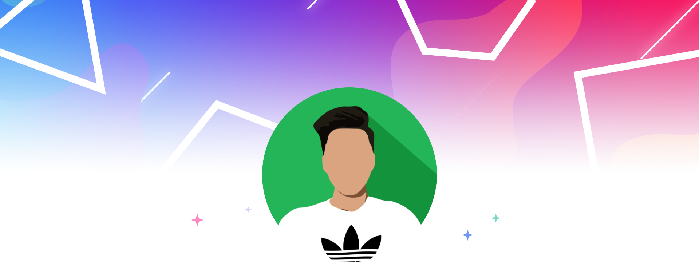
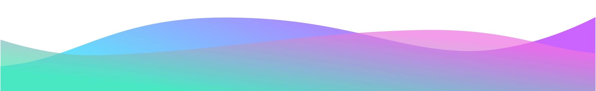

<!--
  If you decide to fork my README, please give credit! I spent a lot of time working on it 😄.
  Credit to https://github.com/tthn0/tthn0 for README idea.
-->


<div align="center">
  
</div>

<h3 align="center">
  Hey there, I’m Thomas
  
</h3>

<div align="center">
  I'm a <strong>software engineer</strong> focusing primarily on full stack web development. I am ✨ passionate ✨ about computer science, and I also have a strong love for mathematics. I'm making projects or learning something new just about every day. You can find my coolest projects here on my GitHub!
</div>

<hr>

<!-- https://github.com/badges/shields -->

<div align="center">
  <h4> Languages I've played with</h4> 
  
  
  
  
  
  
  
  
  
  
  
  
  
</div>

<!-- <div align="center">
  <h4> Libraries, frameworks, and tools I've used</h4>
  
  
  
  
  
  
  
  
  
  
  
  <img src="https://img.shields.io/badge/-SQL%20Server-BA2724?style=for-the-badge&logo=data:image/svg+xml;base64,PHN2ZyB3aWR0aD0iNDAiIGhlaWdodD0iNTAiIHZpZXdCb3g9IjAgMCA0MCA1MCIgZmlsbD0ibm9uZSIgeG1sbnM9Imh0dHA6Ly93d3cudzMub3JnLzIwMDAvc3ZnIj4KPHBhdGggZD0iTTQuMDAxOTggMzQuMjY1MUMzLjc5MTU5IDM0LjQ1NTcgMy42MDIyNCAzNC42NDYzIDMuNDMzOTIgMzQuODM2OUMyLjAwMzI2IDM2LjM2MTcgLTAuNDM3Mjg1IDM5LjUzODMgMC4wNjc2NTU0IDQyLjE4NTVDMC4xMDk3MzQgNDIuNDE4NSAwLjE5Mzg5IDQyLjY1MTQgMC4yNzgwNDcgNDIuODg0NEMyLjc2MDY3IDQ2LjcxNzUgNy42NDE3NiA0OC4yNjM0IDEyLjAxNzkgNDguOTYyM0MxMi4xODYyIDQ4Ljk4MzUgMTIuMzU0NSA0OS4wMDQ3IDEyLjUyMjggNDkuMDQ3QzE2LjUyMDMgNDkuNjYxMiAyMS45NDg0IDUwIDIxLjk0ODQgNTBDMjEuOTQ4NCA1MCAyMi43MDU4IDQ4LjQ3NTIgMjMuNzE1NyA0Ni4yNzI4QzIzLjc3ODggNDYuMTI0NSAyMy44NjMgNDUuOTU1MSAyMy45MjYxIDQ1Ljc4NTdDMjYuMDkzMSA0MC4yNTg0IDI3LjEyNCAzNC41ODI4IDI3LjEyNCAyOC45Mjg0QzI3LjEyNCAyOC42MzE5IDI3LjE0NTEgMjguMzM1NCAyNy4xNDUxIDI4LjAzOUMyNy4xNDUxIDI2Ljk1ODkgMjcuMDgyIDI2LjAwNTkgMjYuOTM0NyAyNS4zMDcxQzIxLjQyMjQgMjYuOTgwMSAxNS40ODk0IDI5LjAxMzEgMTIuODE3NCAzMC4xOTkxQzkuMDkzNDYgMzEuODUwOSA0LjEyODIyIDM0LjIwMTYgNC4wMDE5OCAzNC4yNjUxWiIgZmlsbD0id2hpdGUiLz4KPHBhdGggZD0iTTIwLjMwNzMgNS4xNDYxMkMxOS40MjM3IDMuMTk3OCAxOC4xNDAzIDAgMTguMTQwMyAwTDcuOTE1MjcgNi4wNTY3NkM3LjkxNTI3IDYuMDU2NzYgMTUuNTMxNCA3Ljg1Njg0IDIyLjM5MDIgOS4yNTQ1NUMyMS41NDg2IDcuNjAyNzEgMjAuNzcwMiA2LjE4MzgyIDIwLjMwNzMgNS4xNDYxMloiIGZpbGw9IndoaXRlIi8+CjxwYXRoIGQ9Ik0yMS4yOTYyIDE4Ljc4NDRDMTguNTE5IDIyLjU3NTIgMTUuMjM2OSAyNS45ODQ3IDExLjU1NSAyOC45Mjg0QzExLjgyODYgMjguODAxMyAxMi4xMDIxIDI4LjY3NDMgMTIuMzc1NiAyOC41Njg0QzEzLjk3NDUgMjcuODQ4NCAxNi45NDExIDI2Ljc4OTUgMjAuMTgxMSAyNS43MzA2QzIyLjIyMTkgMjQuMTQyMyAyNC4xMzY1IDIyLjM4NDYgMjUuOTAzOCAyMC40OTk4QzI0LjQzMSAxOS44NDMzIDIyLjg5NTIgMTkuMjcxNSAyMS4yOTYyIDE4Ljc4NDRaIiBmaWxsPSJ3aGl0ZSIvPgo8cGF0aCBkPSJNMjMuNzU3OCAxMS4xODE3QzIzLjMzNyAxMS4wOTcgMjIuOTE2MiAxMS4wMTIzIDIyLjQ1MzMgMTAuOTI3NkMyMS44NjQyIDEwLjgyMTcgMjEuMjMzMSAxMC42OTQ2IDIwLjYyMjkgMTAuNTY3NkMxNC43MTA5IDkuMzgxNjIgOC4xODg3OCA3LjgzNTY2IDguMTg4NzggNy44MzU2NkM4LjE4ODc4IDcuODM1NjYgOS43MjQ2MyA5LjQ2NjMzIDExLjEzNDMgMTEuMDU0NkMxMS4yMTg0IDExLjE2MDUgMTEuMzIzNiAxMS4yNjY0IDExLjQwNzggMTEuMzcyM0MxMi4yMDczIDEyLjMyNTMgMTIuODM4NCAxMy40MjY1IDEzLjI4MDMgMTQuNTkxM0MxMy4zMDEzIDE0LjY3NiAxMy4zMjIzIDE0LjcxODMgMTMuMzY0NCAxNC44MDNDMTMuMzY0NCAxNC44MjQyIDEzLjM2NDQgMTQuODQ1NCAxMy4zODU0IDE0Ljg2NjZDMTMuMzg1NCAxNC44ODc4IDEzLjM4NTQgMTQuODg3OCAxMy40MDY1IDE0LjkwODlDMTUuODA1IDE1LjI2OSAxOC4yMDM0IDE1Ljc5ODQgMjAuNTgwOCAxNi40NzYxQzIxLjcxNyAxNC44MDMgMjIuNzkgMTMuMDI0MSAyMy43NTc4IDExLjE4MTdaTTEzLjgyNzMgMTMuOTM0OEMxMy44NDgzIDE0LjAxOTUgMTMuODkwNCAxNC4xMDQyIDEzLjkxMTQgMTQuMTg4OUMxMy45MTE0IDE0LjIxMDEgMTMuOTMyNSAxNC4yMzEzIDEzLjkzMjUgMTQuMjczNkMxMy44OTA0IDE0LjE0NjUgMTMuODY5NCAxNC4wNDA3IDEzLjgyNzMgMTMuOTM0OFoiIGZpbGw9IndoaXRlIi8+CjxwYXRoIGQ9Ik0yNy4zMzQ0IDE4Ljk1MzhDMjguOTEyNCAxNy4xNTM4IDMwLjM0MyAxNS4yMjY2IDMxLjY2ODUgMTMuMjE0N0MzMC4wNjk1IDEyLjYyMTggMjguMTU0OSAxMi4xMTM1IDI1Ljc1NjUgMTEuNjA1M0MyNC43Njc2IDEzLjUxMTIgMjMuNjczNiAxNS4zNTM3IDIyLjQ5NTQgMTcuMTExNEMyNC4xMzY1IDE3LjY0MDggMjUuNzU2NSAxOC4yNTUgMjcuMzM0NCAxOC45NTM4WiIgZmlsbD0id2hpdGUiLz4KPHBhdGggZD0iTTE5LjI5NzUgMTguMTkxNUMxNy41MDkxIDE3LjcwNDQgMTUuNjk5OCAxNy4zMDIgMTMuODkwNCAxNy4wMDU1QzE0LjE2MzkgMTguODI2OCAxNC4wMTY2IDIwLjY2OTIgMTMuMzAxMyAyMi4zNDIyQzEzLjIxNzEgMjIuNTU0IDEzLjExMTkgMjIuNzY1OCAxMi45ODU3IDIyLjk3NzZDMTIuNzU0MyAyMy40MDExIDEyLjQ4MDggMjMuODI0NyAxMi4xNjUyIDI0LjI0ODJDMTIuMTY1MiAyNC4yNDgyIDEyLjE2NTIgMjQuMjQ4MiAxMi4xNjUyIDI0LjI2OTRDMTEuMTk3NCAyNS41MTg5IDguODE5OTUgMjguMDE3OCA3LjAzMTYyIDI5Ljg2MDJDMTEuNzQ0NCAyNi42NDEzIDE1Ljg4OTEgMjIuNzAyMyAxOS4yOTc1IDE4LjE5MTVaIiBmaWxsPSJ3aGl0ZSIvPgo8cGF0aCBkPSJNMjQuOTk5MSAyNC4yMDU4QzI2Ljc4NzQgMjMuNjU1MiAyOC40OTE2IDIzLjE2ODEgMjkuOTY0MyAyMi43NjU4QzMwLjExMTYgMjIuNzIzNCAzMC4yNTg5IDIyLjY4MTEgMzAuNDI3MiAyMi42Mzg3QzI5LjU4NTYgMjIuMTcyOCAyOC43MjMgMjEuNzI4MSAyNy44Mzk0IDIxLjMyNTdDMjYuOTEzNiAyMi4zMjEgMjUuOTg3OSAyMy4yOTUyIDI0Ljk5OTEgMjQuMjA1OFoiIGZpbGw9IndoaXRlIi8+CjxwYXRoIGQ9Ik0zMy4xNDEyIDIxLjkxODdDMzcuMDk2NiAyMC44Mzg2IDQwIDIwLjAzMzkgNDAgMjAuMDMzOUM0MCAyMC4wMzM5IDM3LjY4NTcgMTYuNzkzNyAzNS4wMTM3IDE0LjkwODlDMzQuNTUwOSAxNC41NzAxIDM0LjA0NTkgMTQuMjk0OCAzMy40OTg5IDE0LjAxOTVDMzIuMTk0NSAxNi4wNTI1IDMwLjc0MjggMTcuOTc5NyAyOS4xODU5IDE5LjgwMDlDMzAuNTMyNCAyMC40NTc0IDMxLjg1NzggMjEuMTU2MyAzMy4xNDEyIDIxLjkxODdaIiBmaWxsPSJ3aGl0ZSIvPgo8cGF0aCBkPSJNMTMuODI3MyAxMy45MzQ4QzEzLjg2OTQgMTQuMDQwNyAxMy45MTE0IDE0LjE0NjYgMTMuOTUzNSAxNC4yNzM2QzEzLjk1MzUgMTQuMjUyNCAxMy45MzI1IDE0LjIzMTMgMTMuOTMyNSAxNC4xODg5QzEzLjg5MDQgMTQuMDgzIDEzLjg0ODMgMTQuMDE5NSAxMy44MjczIDEzLjkzNDhaIiBmaWxsPSJ3aGl0ZSIvPgo8L3N2Zz4K&logoColor=white&labelColor=black">
  
  
  
  
  
  
  
  
  
  
  
  
  
  
  
</div> -->

<hr>

<h3>🌎 Bio</h3>

```sh
tthn0@github
┌─────────────────────────────────────────────────────────────┐
│         /\          ♚ OS         ~   Thomas ☻               │
│        /  \         ♛ Host       ~   Houston, TX            │
│       /\   \        ♜ Uptime     ~   21 years               │
│      /      \                                               │
│     /   ,,   \      ♝ Kernel     ~   University of Houston  │
│    /   |  |  -\     ♞ Shell      ~   B.S. Computer Science  │
│   /_-''    ''-_\    ♟ Packages   ~   2025                   │
└─────────────────────────────────────────────────────────────┘
```

```typescript
class Thomas {
  skills: string[] = [
    "Full Stack Web Development",
    "Application Security",
    "Data Structures",
    "Algorithms",
    "Databases",
  ];
  pronouns: string[];
  constructor(...pronouns: string[]) {
    this.pronouns = pronouns;
  }
  get interests(): string[] {
    return ["UI/UX", "Ethical Hacking", "Mathematics"];
  }
  learn(skill: string, timeCommitment: number): void {
    setTimeout(() => {
      this.skills.push(skill);
    }, timeCommitment);
  }
}
const me = new Thomas("He", "Him", "His");
me.learn("Angular", 1000 * 60 * 60 * 24 * 30 * 3);
```

<h3>🎶 Vibing to</h3>

<a href="https://github.com/tthn0/Spotify-Readme">
  <picture>
    <source
      media="(prefers-color-scheme: light), (prefers-color-scheme: no-preference)"
      srcset="https://tthn.pythonanywhere.com?theme=light&scan=true&eq_color=rainbow"
    />
    <source
      media="(prefers-color-scheme: dark)"
      srcset="https://tthn.pythonanywhere.com?theme=dark&scan=true&eq_color=rainbow"
    />
     <!-- https://github.com/tthn0/Spotify-Readme -->
  </picture>
</a>

<h3>📈 Interesting numbers</h3>

<div>
  <picture>
    <source
      media="(prefers-color-scheme: light), (prefers-color-scheme: no-preference)"
      srcset="https://github-readme-stats.vercel.app/api?username=tthn0&card_width=495&count_private=true&include_all_commits=true&show_icons=true&hide_border=true&theme=default&bg_color=F6F8FA"
    />
    <source
      media="(prefers-color-scheme: dark)"
      srcset="https://github-readme-stats.vercel.app/api?username=tthn0&card_width=495&count_private=true&include_all_commits=true&show_icons=true&hide_border=true&theme=github_dark&bg_color=161B22"
    />
     <!-- https://github.com/anuraghazra/github-readme-stats-->
  </picture>
</div>

<div>
  <picture>
    <source
      media="(prefers-color-scheme: light), (prefers-color-scheme: no-preference)"
      srcset="https://github-readme-stats.vercel.app/api/top-langs?username=tthn0&langs_count=8&layout=compact&card_width=495&count_private=true&include_all_commits=true&show_icons=true&hide_border=true&theme=default&bg_color=F6F8FA"
    />
    <source
      media="(prefers-color-scheme: dark)"
      srcset="https://github-readme-stats.vercel.app/api/top-langs?username=tthn0&langs_count=8&layout=compact&card_width=495&count_private=true&include_all_commits=true&show_icons=true&hide_border=true&theme=github_dark&bg_color=161B22"
    />
     <!-- https://github.com/anuraghazra/github-readme-stats-->
  </picture>
</div>

<div>
  <picture>
    <source
      media="(prefers-color-scheme: light), (prefers-color-scheme: no-preference)"
      srcset="https://github-readme-streak-stats.herokuapp.com?user=tthn0&hide_border=true&ring=5D99FE&theme=default&background=F6F8FA&currStreakLabel=000"
    />
    <source
      media="(prefers-color-scheme: dark)"
      srcset="https://github-readme-streak-stats.herokuapp.com?user=tthn0&hide_border=true&ring=5D99FE&theme=dark&background=161B22&currStreakLabel=FFF"
    />
     <!-- https://github.com/DenverCoder1/github-readme-streak-stats -->
  </picture>
</div>

<h3>🛠 Architecture</h3>

```css
> fetch
```

```css
⬡ OS     ~  macOS
⏏ Host   ~  MacBook Air M1
⚙ Shell  ~  zsh
```

<h3>📚 Certifications</h3>

| [][Word]    | [**Microsoft Word**][Word]   |
| ---------------------------------------------------------------------------- | ---------------------------- |
| [][Excel] | [**Microsoft Excel**][Excel] |

[Word]: https://www.youracclaim.com/badges/b7ab3bcd-f0b1-4ed3-9bdf-c225dcb4f6ee/public_url
[Excel]: https://www.youracclaim.com/badges/5a447ee2-0dce-494b-b55a-6b667b628b69/public_url

<div>
  
</div>


<!-- Extras:
- 🔭 I’m currently working on ...
- 🌱 I’m currently learning ...
- 👯 I’m looking to collaborate on ...
- 🤔 I’m looking for help with ...
- 💬 Ask me about ...
- 📫 How to reach me: ...
- 😄 Pronouns: ...
- ⚡ Fun fact: ... -->
